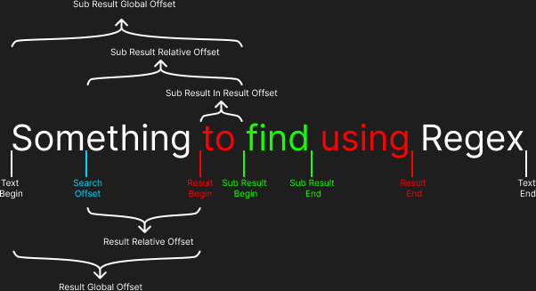

# pcre2cpp

**pcre2cpp** is a C++ wrapper for the PCRE2 (Perl Compatible Regular Expressions) library written in C. It provides an object-oriented interface for the original PCRE2 library, while maintaining the same functionality and behavior.

## Features

- Object-oriented interface to PCRE2 10.44.
- Compatible with C++20.
- Easy to use regular expression matching with built-in result capturing.

## Installation

To use **pcre2cpp**, simply download the latest release. There are no additional dependencies required.

1. Download the latest release of **pcre2cpp**.
2. Link the `pcre2cpp` library statically in your build system (e.g., `CMake` or `Make`).

Example for linking in `CMake`:
```cmake
find_package(pcre2cpp REQUIRED)
target_link_libraries(your_project_name PRIVATE pcre2cpp)
```

## Example Usage

### Basic Match

```cpp
#include <pcre2cpp/pcre2cpp.hpp>
#include <iostream>

using namespace std;
using namespace pcre2cpp;

int main() {
    regex expression("\\d+");
    
    if (expression.match("2")) { // is true
        cout << "Matches" << endl;
    }

    if (expression.match("a")) { // is false
        cout << "Matches" << endl;
    }

    if (expression.match("a2")) { // is true
        cout << "Matches" << endl;
    }
    
    return 0;
}
```

### Match with Result

```cpp
#include <pcre2cpp/pcre2cpp.hpp>
#include <iostream>

using namespace std;
using namespace pcre2cpp;

int main() {
    regex expression("\\d+");
    
    match_result result;
    if (expression.match("aa2", result, 2)) { // is true
        cout << "Matches result: " << result.get_result_value() << " at: " 
             << to_string(result.get_result_global_offset()) << endl;

        // Should print "Matches result: 2 at: 2"
    }
    
    return 0;
}
```

### Match at Specified Offset

```cpp
#include <pcre2cpp/pcre2cpp.hpp>
#include <iostream>

using namespace std;
using namespace pcre2cpp;

int main() {
    regex expression("\\d+");
    
    if (expression.match_at("aa2", 3, 2)) { // is true
        cout << "Matches result: 2 at: 2" << endl;
    }

    if (expression.match_at("aa2", 3, 1)) { // is false
        cout << "Matches result: 2 at: 2" << endl;
    }
    
    return 0;
}
```

### Match at Specified Offset with Result

```cpp
#include <pcre2cpp/pcre2cpp.hpp>
#include <iostream>

using namespace std;
using namespace pcre2cpp;

int main() {
    regex expression("\\d+");
    
    match_result result;
    if (expression.match_at("aa2", 3, result, 2)) { // is true
        cout << "Matches result: " << result.get_result_value() << " at: " 
             << to_string(result.get_result_global_offset()) << endl;

        // Should print: "Matches result: 2 at: 2"
    }
    
    return 0;
}
```

### Match with Indexed Subexpression

```cpp
#include <pcre2cpp/pcre2cpp.hpp>
#include <iostream>

using namespace std;
using namespace pcre2cpp;

int main() {
    regex expression("(\\d+)(a)");
    
    match_result result;
    if (expression.match("ab23a", result, 1)) { // is true
        cout << "Sub Match 0 result: " << result.get_sub_result_value(0) << " at: "
        << result.get_sub_result_global_offset(0) << ", Sub Match 1 result: "
        << result.get_sub_result_value(1) << " at: " 
        << result.get_sub_result_global_offset(1) << endl;

        // Should print: "Sub Match 0 result: 23 at: 2, Sub Match 1 result: a at: 4"
    }
    
    return 0;
}
```

### Match with Named Subexpression

```cpp
#include <pcre2cpp/pcre2cpp.hpp>
#include <iostream>

using namespace std;
using namespace pcre2cpp;

int main() {
    regex expression("(?<number>\\d+)(?<a>a)");
    
    match_result result;
    if (expression.match("ab23a", result, 1)) { // is true
        cout << "Sub Match <number> result: " << result.get_sub_result_value("number")
        << " at: " << result.get_sub_result_global_offset("number") 
        << ", Sub Match 1 result: " << result.get_sub_result_value("a") 
        << " at: " << result.get_sub_result_global_offset("a") << endl;

        // Should print: "Sub Match <number> result: 23 at: 2, Sub Match <a> result: a at: 4"
    }
    
    return 0;
}
```

### Match All

```cpp
#include <pcre2cpp/pcre2cpp.hpp>
#include <iostream>

using namespace std;
using namespace pcre2cpp;

int main() {
    regex expression("\\d+");
    
    std::vector<match_result> results;
    if (expression.match_all("Ala ma 23 lata i 3 koty", 23, results)) { // is true
        cout << "Match 0 result: " << results[0].get_result_value() 
        << " at: " << results[0].get_result_global_offset() 
        << ", Match 1 result: " << results[1].get_result_value() 
        << " at: " << results[1].get_result_global_offset() << endl;

        // Should print: "Match 0 result: 23 at: 7, Match 1 result: 3 at: 17"
    }

    match_result* resultsPtr;
    size_t resultsCount;
    if (expression.match_all("Ala ma 23 lata i 3 koty", 23, resultsPtr, resultsCount)) { // is true
        cout << "Match 0 result: " << resultsPtr[0].get_result_value() 
        << " at: " << resultsPtr[0].get_result_global_offset() 
        << ", Match 1 result: " << resultsPtr[1].get_result_value() 
        << " at: " << resultsPtr[1].get_result_global_offset() << endl;

        // Should print: "Match 0 result: 23 at: 7, Match 1 result: 3 at: 17"

        delete[] resultsPtr;
    }
    
    return 0;
}
```

## Offsets Graph


## Requirements

- C++20 or newer.

## License

This project is licensed under the **BSD 3-Clause License with Attribution Requirement**. For more details, check the [LICENSE](./LICENSE) file.

## Acknowledgments

This project includes code from the [PCRE2 library](https://github.com/PhilipHazel/pcre2), distributed under the BSD License.