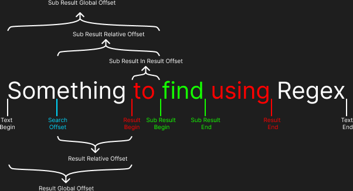

# pcre2cpp

**pcre2cpp** is a C++ wrapper for the PCRE2 (Perl Compatible Regular Expressions) library written in C. It provides an
object-oriented interface for the original PCRE2 library, while maintaining the same functionality and
behavior. [DOCS](https://maipa01.github.io/pcre2cpp/html "Documentation")

## Features

- Object-oriented interface to PCRE2 10.47.
- Compatible with C++17 and newer.
- Easy to use regular expression matching with built-in result capturing.

## Requirements

- C++17 or newer.
- CMAKE 3.30 or newer

## Options

### Compilation defines options

You can enable option using `#define option_name` or use cmake `set(option_name ON CACHE BOOL)`

| Cmake option/C++ define Name            | Description                                    | Default |
|:----------------------------------------|:-----------------------------------------------|:-------:|
| `PCRE2CPP_ENABLE_CXX20`                 | Enables C++20 features                         |   OFF   |
| `PCRE2CPP_DISABLE_ASSERT_ON_RELEASE`    | Disables assert on release builds              |   OFF   |
| `PCRE2CPP_CHANGE_ASSERTS_TO_EXCEPTIONS` | Changes every assert to exceptions in pcre2cpp |   OFF   |
| `PCRE2CPP_DISABLE_UTF8`                 | Disables UTF-8 support                         |   OFF   |
| `PCRE2CPP_DISABLE_UTF16`                | Disables UTF-16 support                        |   OFF   |
| `PCRE2CPP_DISABLE_UTF32`                | Disables UTF-32 support                        |   OFF   |

There is additional define if you want to use pcre2 as shared library insted of static `PCRE2CPP_SHARED_LIB`. In cmake
project its value depends on `BUILD_SHARED_LIBS` option

### External libraries options

If you want to use external libraries not installed by project using CPM

| Cmake option Name         | Description                                                      | Default |
|:--------------------------|:-----------------------------------------------------------------|:-------:|
| `PCRE2CPP_MSTD_EXTERNAL`  | Uses users own mstd library (tested and compatible with: 1.5.3)  |   OFF   |
| `PCRE2CPP_PCRE2_EXTERNAL` | Uses users own pcre2 library (tested and compatible with: 10.47) |   OFF   |

### Project developing options

These options are used while testing or changing code in project

| Cmake option Name              | Description                                            |          Default          |
|:-------------------------------|:-------------------------------------------------------|:-------------------------:|
| `PCRE2CPP_BUILD_TESTS`         | Build tests                                            | `${PROJECT_IS_TOP_LEVEL}` |
| `PCRE2CPP_BUILD_BENCHMARK`     | Build benchmark                                        | `${PROJECT_IS_TOP_LEVEL}` |
| `PCRE2CPP_BUILD_COVERAGE`      | Enable coverage reporting                              | `${PROJECT_IS_TOP_LEVEL}` |
| `PCRE2CPP_BUILD_DOCUMENTATION` | Build documentation                                    | `${PROJECT_IS_TOP_LEVEL}` |
| `PCRE2CPP_ENABLE_CLANG_TIDY`   | Enables clang-tidy checks                              | `${PROJECT_IS_TOP_LEVEL}` |
| `PCRE2CPP_INSTALL`             | Enables installation of this project                   | `${PROJECT_IS_TOP_LEVEL}` |
| `PCRE2CPP_INSTALL_TEST`        | This is only to test if installation of pcre2cpp works |            OFF            |

## Benchmarks

### Compilation (10,000 iterations)

| No.     | std::regex (ms) | PCRE2 (ms)  | pcre2cpp (ms) |
|:--------|:---------------:|:-----------:|:-------------:|
| **1.**  |     72,9598     | **16,1092** |    18,5241    |
| **2.**  |     57,5480     | **15,6274** |    18,1612    |
| **3.**  |     57,0869     | **15,7417** |    18,3947    |
| **4.**  |     57,3934     | **15,6203** |    18,6631    |
| **5.**  |     44,9840     | **15,2435** |    18,5194    |
| **6.**  |     57,6100     | **15,5350** |    18,3712    |
| **7.**  |     43,8009     | **15,6640** |    17,8529    |
| **8.**  |     57,7913     | **15,6265** |    18,1389    |
| **9.**  |     59,1878     | **15,5679** |    18,3997    |
| **10.** |     57,9911     | **15,4088** |    18,0916    |

| regex          |  Avg (ms)   |            Overhead (ms)             | Per Iteration Avg (ms) |     Per Iteration Overhead (ms)     |
|:---------------|:-----------:|:------------------------------------:|:----------------------:|:-----------------------------------:|
| **std::regex** |   56,6353   | $${\color{green}{\text{-38,3236}}}$$ |         0,0057         | $${\color{green}{\text{-0,0038}}}$$ |
| **PCRE2**      | **15,6144** |   $${\color{red}{\text{2,6973}}}$$   |       **0,0016**       |  $${\color{red}{\text{0,0003}}}$$   |
| **pcre2cpp**   |   18,3117   |                  -                   |         0,0018         |                  -                  |

### Match (10,000 iterations)

| No.     | std::regex (ms) | PCRE2 (ms) | pcre2cpp (ms) |
|:--------|:---------------:|:----------:|:-------------:|
| **1.**  |    200,0510     | **7,6231** |    7,6295     |
| **2.**  |    210,2780     | **7,7943** |    8,0054     |
| **3.**  |    197,5870     |   7,9984   |  **7,7851**   |
| **4.**  |    198,2510     | **7,6498** |    8,0657     |
| **5.**  |    199,3080     |   8,0307   |  **7,7707**   |
| **6.**  |    199,4860     |   7,9415   |  **7,8639**   |
| **7.**  |    197,2080     |   8,0802   |  **7,9928**   |
| **8.**  |    197,3450     | **7,7989** |    8,1371     |
| **9.**  |    200,0030     | **7,9187** |    8,2530     |
| **10.** |    197,8760     | **7,9905** |    8,2095     |

| regex          |  Avg (ms)  |             Overhead (ms)             | Per Iteration Avg (ms) |     Per Iteration Overhead (ms)     |
|:---------------|:----------:|:-------------------------------------:|:----------------------:|:-----------------------------------:|
| **std::regex** |  199,7393  | $${\color{green}{\text{-191,7680}}}$$ |         0,0200         | $${\color{green}{\text{-0,0192}}}$$ |
| **PCRE2**      | **7,8826** |   $${\color{red}{\text{0,0887}}}$$    |       **0,0008**       | $${\color{green}{\text{0,0000}}}$$  |
| **pcre2cpp**   |   7,9713   |                   -                   |       **0,0008**       |                  -                  |

### Match with all results (10,000 iterations)

| No.     | std::regex (ms) | PCRE2 (ms)  | pcre2cpp (ms) |
|:--------|:---------------:|:-----------:|:-------------:|
| **1.**  |    200,0060     | **9,7453**  |    11,9927    |
| **2.**  |    196,6940     | **10,7646** |    12,5312    |
| **3.**  |    197,8630     | **9,8459**  |    16,1080    |
| **4.**  |    198,6790     | **9,5077**  |    12,0731    |
| **5.**  |    198,5960     | **10,1264** |    12,7155    |
| **6.**  |    197,2710     | **9,6796**  |    12,5729    |
| **7.**  |    217,3730     | **23,5250** |    26,8198    |
| **8.**  |    197,2450     | **10,1512** |    12,6728    |
| **9.**  |    202,4240     | **9,8813**  |    12,8561    |
| **10.** |    198,0520     | **10,0214** |    13,3514    |

| regex          |  Avg (ms)   |             Overhead (ms)             | Per Iteration Avg (ms) |     Per Iteration Overhead (ms)     |
|:---------------|:-----------:|:-------------------------------------:|:----------------------:|:-----------------------------------:|
| **std::regex** |  200,4203   | $${\color{green}{\text{-186,0510}}}$$ |         0,0200         | $${\color{green}{\text{-0,0186}}}$$ |
| **PCRE2**      | **11,3248** |   $${\color{red}{\text{3,0445}}}$$    |       **0,0011**       |  $${\color{red}{\text{0,0003}}}$$   |
| **pcre2cpp**   |   14,3694   |                   -                   |         0,0014         |                  -                  |

## Installation

After installing, you can use `find_package(pcre2cpp)`.

### Components

You can also include components `find_pcakage(pcre2cpp COMPONENTS comp)`. They work the same way
as [Compilation defines options](#compilation-defines-options), but
they provide separate components you need to include.

| Component Name       | Option                                  | Target Name                    |
|:---------------------|:----------------------------------------|:-------------------------------|
| CXX20                | `PCRE2CPP_ENABLE_CXX20`                 | pcre2cpp::CXX20                |
| NO_ASSERT_ON_RELEASE | `PCRE2CPP_DISABLE_ASSERT_ON_RELEASE`    | pcre2cpp::NO_ASSERT_ON_RELEASE |
| EXCEPTIONS           | `PCRE2CPP_CHANGE_ASSERTS_TO_EXCEPTIONS` | pcre2cpp::EXCEPTIONS           |
| NO_UTF8              | `PCRE2CPP_DISABLE_UTF8`                 | pcre2cpp::NO_UTF8              |
| NO_UTF16             | `PCRE2CPP_DISABLE_UTF16`                | pcre2cpp::NO_UTF16             |
| NO_UTF32             | `PCRE2CPP_DISABLE_UTF32`                | pcre2cpp::NO_UTF32             |

## Example Usage

### Basic Match

```cpp
#include <pcre2cpp/pcre2cpp.hpp>
#include <iostream>

using namespace std;
using namespace pcre2cpp;

int main() {
    regex expression("\\d+");
    
    if (expression.match("2")) { // is true
        cout << "Matches" << endl;
    }

    if (expression.match("a")) { // is false
        cout << "Matches" << endl;
    }

    if (expression.match("a2")) { // is true
        cout << "Matches" << endl;
    }
    
    return 0;
}
```

### Match with Result

```cpp
#include <pcre2cpp/pcre2cpp.hpp>
#include <iostream>

using namespace std;
using namespace pcre2cpp;

int main() {
    regex expression("\\d+");
    
    match_result result;
    if (expression.match("aa2", result, 2)) { // is true
        cout << "Matches result: " << result.get_result_value() << " at: " 
             << to_string(result.get_result_global_offset()) << endl;

        // Should print "Matches result: 2 at: 2"
    }
    
    return 0;
}
```

### Match at Specified Offset

```cpp
#include <pcre2cpp/pcre2cpp.hpp>
#include <iostream>

using namespace std;
using namespace pcre2cpp;

int main() {
    regex expression("\\d+");
    
    if (expression.match_at("aa2", 3, 2)) { // is true
        cout << "Matches result: 2 at: 2" << endl;
    }

    if (expression.match_at("aa2", 3, 1)) { // is false
        cout << "Matches result: 2 at: 2" << endl;
    }
    
    return 0;
}
```

### Match at Specified Offset with Result

```cpp
#include <pcre2cpp/pcre2cpp.hpp>
#include <iostream>

using namespace std;
using namespace pcre2cpp;

int main() {
    regex expression("\\d+");
    
    match_result result;
    if (expression.match_at("aa2", 3, result, 2)) { // is true
        cout << "Matches result: " << result.get_result_value() << " at: " 
             << to_string(result.get_result_global_offset()) << endl;

        // Should print: "Matches result: 2 at: 2"
    }
    
    return 0;
}
```

### Match with Indexed Subexpression

```cpp
#include <pcre2cpp/pcre2cpp.hpp>
#include <iostream>

using namespace std;
using namespace pcre2cpp;

int main() {
    regex expression("(\\d+)(a)");
    
    match_result result;
    if (expression.match("ab23a", result, 1)) { // is true
        cout << "Sub Match 0 result: " << result.get_sub_result_value(0) << " at: "
        << result.get_sub_result_global_offset(0) << ", Sub Match 1 result: "
        << result.get_sub_result_value(1) << " at: " 
        << result.get_sub_result_global_offset(1) << endl;

        // Should print: "Sub Match 0 result: 23 at: 2, Sub Match 1 result: a at: 4"
    }
    
    return 0;
}
```

### Match with Named Subexpression

```cpp
#include <pcre2cpp/pcre2cpp.hpp>
#include <iostream>

using namespace std;
using namespace pcre2cpp;

int main() {
    regex expression("(?<number>\\d+)(?<a>a)");
    
    match_result result;
    if (expression.match("ab23a", result, 1)) { // is true
        cout << "Sub Match <number> result: " << result.get_sub_result_value("number")
        << " at: " << result.get_sub_result_global_offset("number") 
        << ", Sub Match 1 result: " << result.get_sub_result_value("a") 
        << " at: " << result.get_sub_result_global_offset("a") << endl;

        // Should print: "Sub Match <number> result: 23 at: 2, Sub Match <a> result: a at: 4"
    }
    
    return 0;
}
```

### Match All

```cpp
#include <pcre2cpp/pcre2cpp.hpp>
#include <iostream>

using namespace std;
using namespace pcre2cpp;

int main() {
    regex expression("\\d+");
    
    std::vector<match_result> results;
    if (expression.match_all("Ala ma 23 lata i 3 koty", 23, results)) { // is true
        cout << "Match 0 result: " << results[0].get_result_value() 
        << " at: " << results[0].get_result_global_offset() 
        << ", Match 1 result: " << results[1].get_result_value() 
        << " at: " << results[1].get_result_global_offset() << endl;

        // Should print: "Match 0 result: 23 at: 7, Match 1 result: 3 at: 17"
    }

    match_result* resultsPtr;
    size_t resultsCount;
    if (expression.match_all("Ala ma 23 lata i 3 koty", 23, resultsPtr, resultsCount)) { // is true
        cout << "Match 0 result: " << resultsPtr[0].get_result_value() 
        << " at: " << resultsPtr[0].get_result_global_offset() 
        << ", Match 1 result: " << resultsPtr[1].get_result_value() 
        << " at: " << resultsPtr[1].get_result_global_offset() << endl;

        // Should print: "Match 0 result: 23 at: 7, Match 1 result: 3 at: 17"

        delete[] resultsPtr;
    }
    
    return 0;
}
```

## Offsets Graph



## License

This project is licensed under the **BSD 3-Clause License with Attribution Requirement**. For more details, check
the [LICENSE](./LICENSE "License") file.

## Acknowledgments

This project includes code from the [PCRE2 library](https://github.com/PhilipHazel/pcre2 "PCRE2 github repo"),
distributed under the BSD
License.
